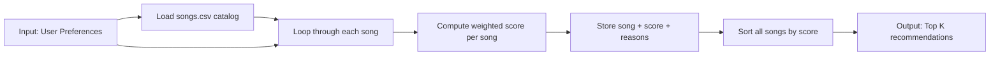
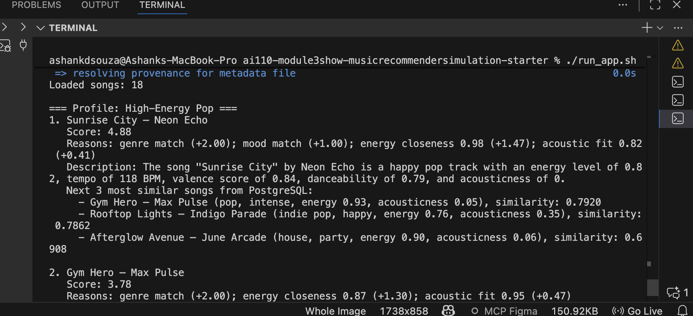
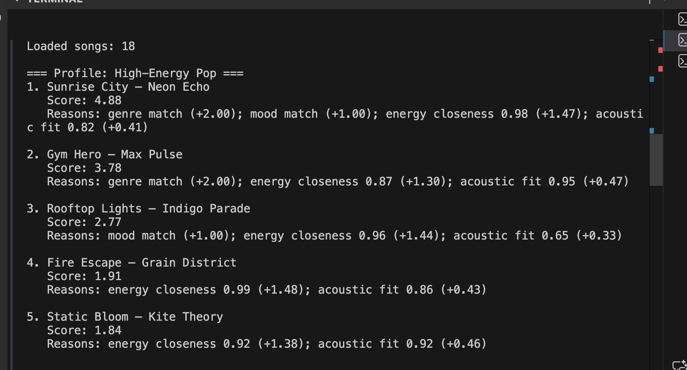
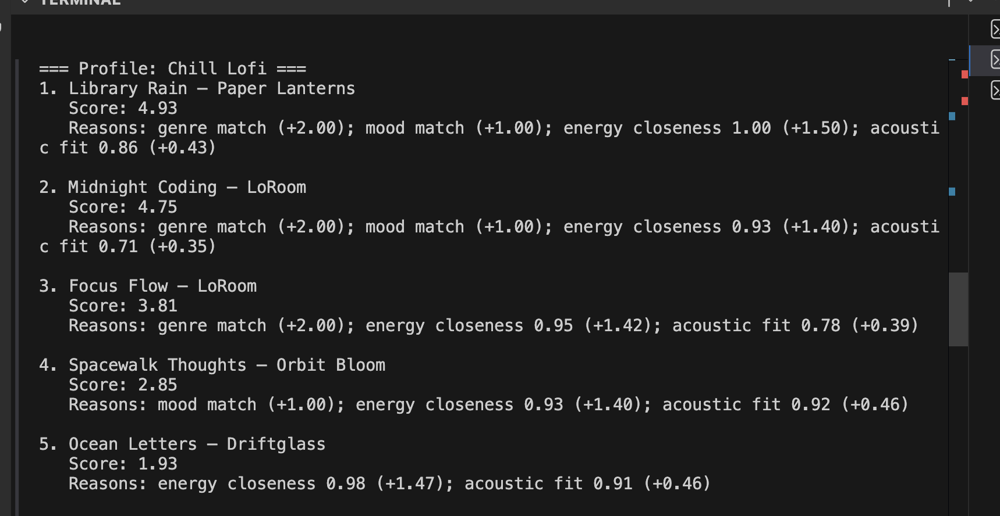
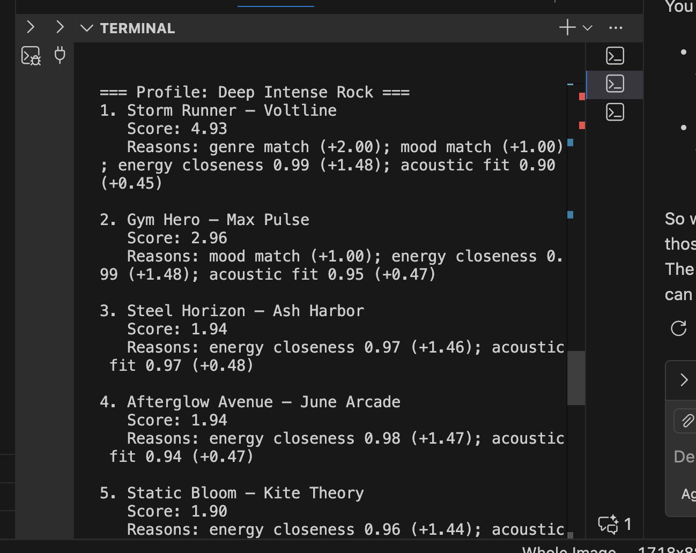
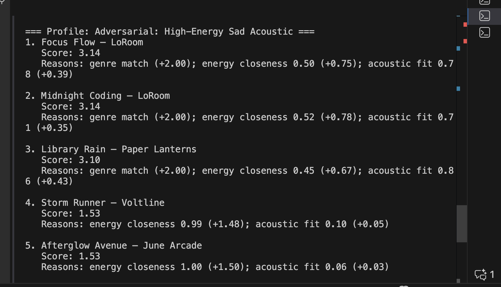
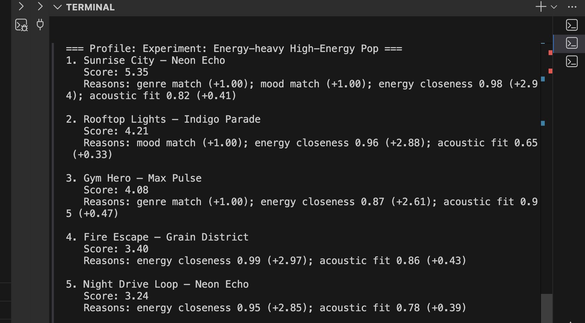

# 🎵 Music Recommender Simulation

## How to run the application 

1. Have docker installed, enabled and running
2. Change all the python3 commands to python or from python3 to python. The project should run using python3 not other python versions. 
3. Run the bash file using [ bash run_app.sh ] or [ chmod +x run_app.sh && ./run_app.sh ]

Also, make sure your computer is well provisioned as the docker containers use a couple of GBs of memory and take time to download. 

## Video Walkthrough

Loom: https://www.loom.com/share/7163565c0e874ff9858f787e1ff1d6c3

## System Architecture

### Design and Architecture: How Your System Fits Together

This project is organized as a lightweight recommender pipeline with clear stages:

- **Retriever**: pulls candidate songs from PostgreSQL (`pgvector`) using embedding similarity.
- **Recommender/Agent**: applies profile-based scoring and ranking logic to produce top recommendations.
- **LLM Summarizer**: generates one-sentence descriptions for recommended tracks.
- **Evaluator/Tester**: checks recommendation quality through profile runs and automated tests.
- **Human-in-the-loop**: reviews outputs, validates relevance, and adjusts feature weights.

> This diagram uses **Mermaid.js** as the source of truth in this README.


**Data flow:** input → retrieval and scoring process → ranked recommendations and explanations.  
**Validation loop:** humans and tests review AI outputs, then feed improvements back into scoring and prompt design.

### Architecture Diagram Export (PNG)

For reproducible documentation assets, build the chart in Mermaid Live Editor and export it as PNG to:

- [assets/system-architecture.png](assets/system-architecture.png)

All architecture images and screenshots should live under [assets/](assets/).


## Project Summary

In this project you will build and explain a small music recommender system.

Your goal is to:

- Represent songs and a user "taste profile" as data
- Design a scoring rule that turns that data into recommendations
- Evaluate what your system gets right and wrong
- Reflect on how this mirrors real world AI recommenders

Replace this paragraph with your own summary of what your version does.

---

## How The System Works

Major platforms like Spotify, YouTube, and TikTok usually combine two methods: collaborative filtering (finding patterns from many users' behavior like likes, skips, watch time, saves, and playlist adds) and content-based filtering (matching item attributes like genre, mood, tempo, and energy to a user's taste). Collaborative filtering helps discover songs users did not explicitly ask for, while content-based filtering helps explain why a song fits a known vibe. In this simulation, I prioritize a transparent content-based approach: each song is scored against a user taste profile using weighted matches, then songs are sorted by score and the top-k are recommended.

### Features used in this simulation

**Song features (`Song`)**
- `genre`
- `mood`
- `energy`
- `acousticness`
- (available for future expansion: `tempo_bpm`, `valence`, `danceability`)

**User taste features (`UserProfile`)**
- `favorite_genre`
- `favorite_mood`
- `target_energy`
- `likes_acoustic`

### Algorithm recipe (concept sketch)

- **Scoring rule (single song):**
  - Add points for exact `genre` and `mood` matches.
  - Add a partial score for numeric closeness, e.g. energy closeness
    $$\text{closeness} = 1 - |\text{song energy} - \text{target energy}|$$
  - Optionally add acoustic preference fit.
- **Ranking rule (all songs):**
  - Compute score for every song.
  - Sort songs from highest to lowest score.
  - Return top $k$ songs with short explanations.

This separation matters because the scoring rule evaluates one candidate, while the ranking rule decides which candidates win when compared across the full catalog.

### Finalized user profile (simulation target)

For this phase, the taste profile I will optimize for is:

- `favorite_genre`: `pop`
- `favorite_mood`: `happy`
- `target_energy`: `0.80`
- `likes_acoustic`: `False`

This profile is broad enough to separate high-energy pop from chill lofi because it combines **categorical** preferences (genre and mood) with **numeric** closeness (energy and acousticness).

### Finalized scoring + ranking plan

For each song, assign points using a weighted scoring rule:

- `+2.0` for exact genre match
- `+1.0` for exact mood match
- `+1.5 × energy_closeness`, where
  $$
  	ext{energy\_closeness} = 1 - |\text{song energy} - \text{target energy}|
  $$
- `+0.5 × acoustic_fit` if `likes_acoustic` is set, where
  $$
  	ext{acoustic\_fit} = 1 - |\text{song acousticness} - \text{acoustic target}|
  $$

Then apply the ranking rule:

1. Score every song in the CSV.
2. Sort by score in descending order.
3. Return top $k$ songs with short explanations of matched features.

### Data-flow map



### Potential bias to watch for

This system may over-prioritize genre and repeatedly recommend similar tracks, which can reduce discovery and create a small filter bubble. Songs from underrepresented genres or moods may be unfairly ranked lower even when they could still fit the listener's vibe.

---

## Getting Started

### Setup

1. Create a virtual environment (optional but recommended):

   ```bash
   python -m venv .venv
   source .venv/bin/activate      # Mac or Linux
   .venv\Scripts\activate         # Windows

2. Install dependencies

```bash
pip install -r requirements.txt
```

3. (Optional, recommended) Run a free local LLM with Ollama

```bash
# Install Ollama (macOS)
brew install ollama

# Start Ollama service
ollama serve

# In another terminal, download a small free model
ollama pull qwen2.5:1.5b
```

Set environment variables (optional, defaults already point to Ollama):

```bash
export OPENAI_BASE_URL="http://localhost:11434/v1"
export OPENAI_MODEL="qwen2.5:1.5b"
export OPENAI_API_KEY="ollama"
```

4. Run the app:

```bash
python -m src.main
```

### Running Tests

Run the starter tests with:

```bash
pytest
```

You can add more tests in `tests/test_recommender.py`.

---

## Experiments You Tried

Use this section to document the experiments you ran. For example:

- What happened when you changed the weight on genre from 2.0 to 0.5
- What happened when you added tempo or valence to the score
- How did your system behave for different types of users

### CLI Output Screenshot

Add your terminal screenshot for `python -m src.main` here:



### Phase 4 Evaluation Screenshots

Add one screenshot per profile run:

- High-Energy Pop: 
- Chill Lofi: 
- Deep Intense Rock: 
- Adversarial profile: 
- Weight-shift experiment: 

---

## Limitations and Risks

Summarize some limitations of your recommender.

Examples:

- It only works on a tiny catalog
- It does not understand lyrics or language
- It might over favor one genre or mood

You will go deeper on this in your model card.

---

## Reflection

Read and complete `model_card.md`:

[**Model Card**](model_card.md)

Write 1 to 2 paragraphs here about what you learned:

- about how recommenders turn data into predictions
- about where bias or unfairness could show up in systems like this


---

## 7. `model_card_template.md`

Combines reflection and model card framing from the Module 3 guidance. :contentReference[oaicite:2]{index=2}  

```markdown
# 🎧 Model Card - Music Recommender Simulation

## 1. Model Name

Give your recommender a name, for example:

> VibeFinder 1.0

---

## 2. Intended Use

- What is this system trying to do
- Who is it for

Example:

> This model suggests 3 to 5 songs from a small catalog based on a user's preferred genre, mood, and energy level. It is for classroom exploration only, not for real users.

---

## 3. How It Works (Short Explanation)

Describe your scoring logic in plain language.

- What features of each song does it consider
- What information about the user does it use
- How does it turn those into a number

Try to avoid code in this section, treat it like an explanation to a non programmer.

---

## 4. Data

Describe your dataset.

- How many songs are in `data/songs.csv`
- Did you add or remove any songs
- What kinds of genres or moods are represented
- Whose taste does this data mostly reflect

---

## 5. Strengths

Where does your recommender work well

You can think about:
- Situations where the top results "felt right"
- Particular user profiles it served well
- Simplicity or transparency benefits

---

## 6. Limitations and Bias

Where does your recommender struggle

Some prompts:
- Does it ignore some genres or moods
- Does it treat all users as if they have the same taste shape
- Is it biased toward high energy or one genre by default
- How could this be unfair if used in a real product

---

## 7. Evaluation

How did you check your system

Examples:
- You tried multiple user profiles and wrote down whether the results matched your expectations
- You compared your simulation to what a real app like Spotify or YouTube tends to recommend
- You wrote tests for your scoring logic

You do not need a numeric metric, but if you used one, explain what it measures.

---

## 8. Future Work

If you had more time, how would you improve this recommender

Examples:

- Add support for multiple users and "group vibe" recommendations
- Balance diversity of songs instead of always picking the closest match
- Use more features, like tempo ranges or lyric themes

---

## 9. Personal Reflection

A few sentences about what you learned:

- What surprised you about how your system behaved
- How did building this change how you think about real music recommenders
- Where do you think human judgment still matters, even if the model seems "smart"

